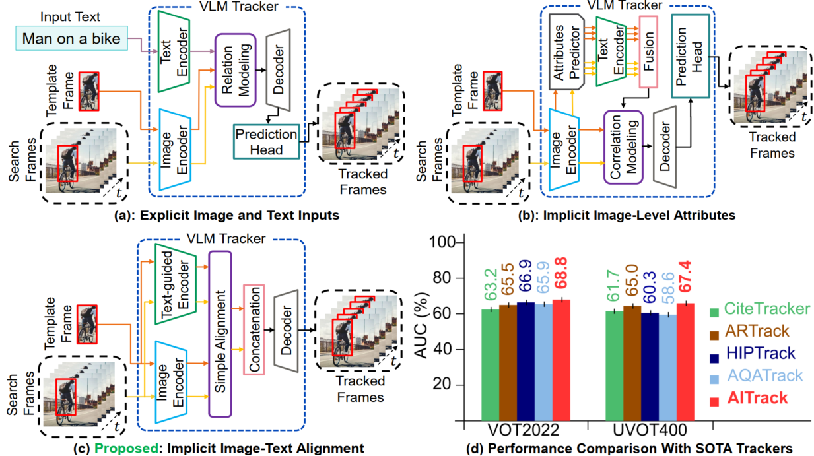
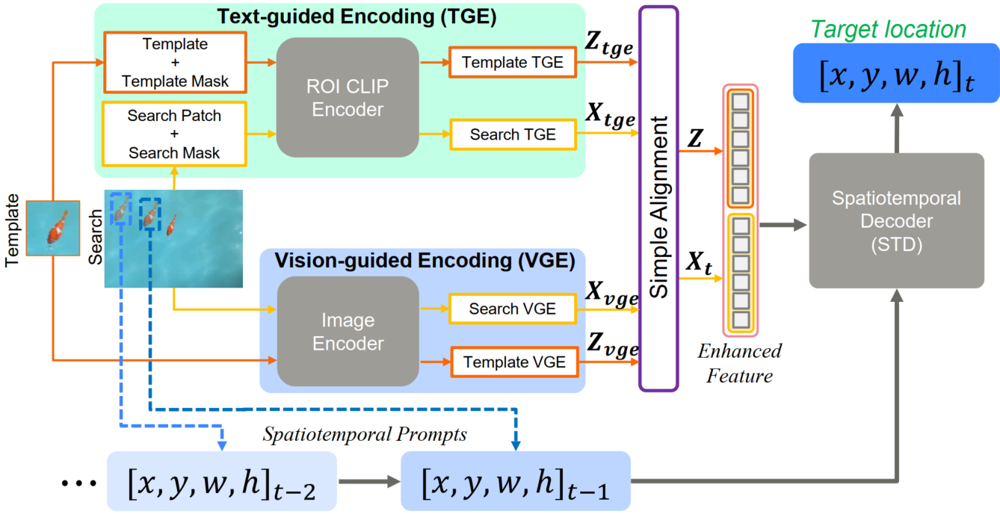

# AITtrack: Attention-based Image-Text Alignment for Visual Tracking

- Repository under construction...
- This is the official implementation of our **AITtrack: Attention-based Image-Text Alignment for Visual Tracking** paper.

### Brief Introduction

Our proposed AITrack simplifies the process of VLM-based tracking using attention-based visual and textual alignment modules. It utilizes a region-of-interest (ROI) text-guided encoder that leverages existing pre-trained language models to implicitly extract and encode textual features and a simple image encoder to encode visual features. A simple alignment module is implemented to combine both encoded visual and textual features, thereby inherently exposing the semantic relationship between the template and search frames with their surroundings, providing rich encodings for improved tracking performance. We employ a simple decoder that takes past predictions as spatiotemporal clues to effectively model the target appearance changes without the need for complex customized postprocessings and prediction heads.

## AITrack Pipeline

### Our Main Contributions

1. We propose an ROI-based text-guided encoder that
leverages existing pre-trained language models to implicitly extract and encode textual descriptions.

2. We propose a simple image-text alignment module that encodes the semantic relationship between the template and search regions with their surroundings, providing rich and meaningful representation for improved VOT
performance.

3. We also incorporate a simple decoder that leverages the spatiotemporal representations to effectively model the target object appearance variations across the video frames without the need for complex customized postprocessings and prediction heads.

4. We perform rigorous experimental evaluations on seven publicly available VOT benchmark datasets to show the advantages of our proposed AITrack.

## Environment Setup

## Dataset Preparation

## Training

## Evaluation

 - Checkpoints

## Acknowledgement

## Citation